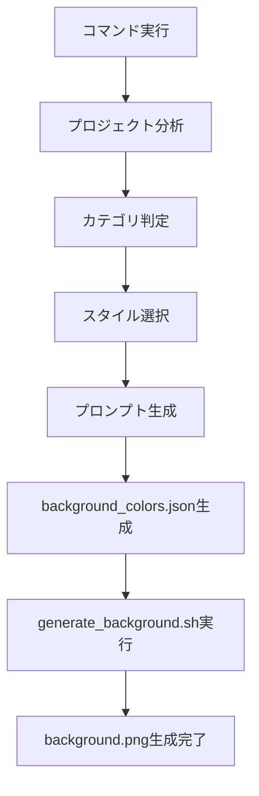

# 🎨  Step 03: アプリアイコン・画像生成プロンプト作成

<!-- PROGRESS_COMMAND_ID: 03-app-icons-images-guide -->
<!-- PROGRESS_PHASE: phase5 -->
<!-- PROGRESS_NAME: アプリアイコン・画像作成 -->
<!-- PROGRESS_STATUS: pending -->
<!-- PROGRESS_RESULT: -->

<!-- LANGUAGE: ja -->
<!-- RESPONSE_LANGUAGE: Japanese -->
<!-- AUTO_EXECUTE: true -->
<!-- NO_USER_INPUT: false -->

**プロンプト生成専用** - 要件定義からAI画像生成プロンプト自動作成

## 📥 企画書参照（品質向上）

```bash
APP_NAME=$(basename $(pwd))
SPEC_PATH=~/kikiki/released/company/planning/specs/${APP_NAME}-spec.md
[ -f "$SPEC_PATH" ] && echo "企画書あり → コンセプト・差別化に合ったビジュアル生成"
```

企画書が存在する場合、コンセプト・ターゲット・差別化ポイントを読み取り、アイコンのトーン・モチーフの判断材料にする。

## 📋 CEO確認ポイント（完了時に必ず実行）

RELEASE_CHECKLIST.md の「CEO確認ポイント」セクションに以下を追記する:
```
- [ ] Step 03: アイコン画像の確認（`creative/app_icon_prompt.txt` でGemini生成後）
```

## 🤖 実行内容

プロジェクトを分析してAI画像生成用のプロンプト（アイコン、スプラッシュロゴ、ウォークスルー画像）を `creative/` に保存します。

---

## 🎨 Assistant実行指示

このコマンドが実行された場合：

### 1. プロジェクト分析

**Step 1.1: アプリコンセプトの取得**

以下の優先順位でアプリ情報を取得：
1. `docs/project/requirements.md` - Phase 1-4 のハイブリッド要件定義
2. `docs/project/business_design.md` - ビジネス設計
3. `docs/project/app_branding.md` - アプリ名・コンセプト
4. `lib/theme/app_theme.dart` - ブランドカラーのみ
5. なければFlutter汎用テンプレートとして処理

**Step 1.2: カテゴリ判定**

アプリコンセプトから以下を判定：
- **アプリカテゴリ**: ユーティリティ、ゲーム、健康、金融、SNS、教育、ライフスタイル等
- **アプリ象徴要素**: アプリを1語で表すシンボル（moon, clock, heart, star, chat, book等）
- **ブランドカラー**: HEXコード（例: #1976D2）

**Step 1.3: 背景スタイルの自動選択**

カテゴリに基づいて背景スタイルを決定：
- ユーティリティ・生産性 → `simple` (単色)
- ゲーム・エンタメ → `luxurious` (豪華グラデーション)
- 健康・フィットネス → `natural` (ナチュラルグラデーション)
- 金融・ビジネス → `professional` (プロフェッショナル)
- SNS・コミュニケーション → `pop` (ポップグラデーション)
- 教育・学習 → `soft` (柔らかいグラデーション)
- ライフスタイル → `trend` (トレンドグラデーション)

### 2. プロンプト生成・保存

**実行フロー:**
1. アイコンプロンプト生成 → `creative/app_icon_prompt.txt`
2. スプラッシュロゴプロンプト生成 → `creative/splash_logo_prompt.txt`
3. ウォークスルー画像プロンプト生成（3種類） → `creative/walkthrough_prompts.txt`
4. **背景画像プロンプト生成 → `creative/background_prompt.txt`**
5. **背景色設定生成 → `creative/background_colors.json`**
6. **generate_background.sh を自動実行してプレビュー背景生成**
7. **screenshots/*/ へ background.png を配布**

**重要**: 各プロンプト内の `[プレースホルダー]` は、Step 1で取得した実際の値に置換すること。

---

**アプリアイコン（1024x1024px）- Gemini Nano Banana最適化:**

**⚠️ 重要: 「app icon」という言葉を使うと角丸が自動適用されやすい。代わりに「square tile design」「graphic design」を使用。**

**📋 Apple HIG 2025準拠:**
- サイズ: 1024x1024px（必須、システムが各サイズに自動縮小）
- 透明度: 禁止（完全不透明必須）
- 色空間: sRGB（Display P3も推奨）
- 角丸: 画像には含めない（iOSが自動適用）
- ダークモード: iOS 26以降は対応推奨

**パターンA: 単色背景（ミニマリスト・ユーティリティ向け）**
```
A large [アプリ象徴要素/geometric moon symbol] in [シンボル色/white],
flat vector graphic design, minimalist style,
centered on solid uniform [ブランドカラー/deep blue #1976D2] background,
PERFECT SQUARE canvas with SHARP 90-degree corners,
symbol occupying 60-70% of canvas,
high contrast, bold geometric shapes,
fully opaque with no transparency.

CRITICAL REQUIREMENTS:
- Canvas shape: PERFECT SQUARE with SHARP CORNERS (not rounded)
- All four corners must be SHARP 90-degree angles
- Edge of image must be STRAIGHT lines meeting at RIGHT ANGLES
- Background extends to the VERY EDGE with no rounded cutoff
- FULLY OPAQUE: No transparency or alpha channel allowed
- Color space: sRGB

Avoid: rounded corners, curved edges, iOS style corners,
pill shape, circular crop, any corner rounding whatsoever,
text, letters, complex details,
transparency, alpha channel, see-through elements.

Output: 1024x1024px square PNG tile with PERFECTLY SHARP CORNERS, fully opaque.
```

**パターンB: グラデーション背景（2025年トレンド・目立たせたい場合）**
```
A large [アプリ象徴要素/geometric moon symbol] in [シンボル色/white],
flat vector graphic design, modern style,
centered on smooth gradient background from [開始色/blue #1976D2] to [終了色/purple #7B1FA2],
PERFECT SQUARE canvas with SHARP 90-degree corners,
symbol occupying 60-70% of canvas,
high contrast, bold geometric shapes,
fully opaque with no transparency.

CRITICAL REQUIREMENTS:
- Canvas shape: PERFECT SQUARE with SHARP CORNERS (not rounded)
- All four corners must be SHARP 90-degree angles
- Background: smooth diagonal or radial gradient
- FULLY OPAQUE: No transparency or alpha channel allowed
- Color space: sRGB

Avoid: rounded corners, curved edges, iOS style corners,
pill shape, circular crop, any corner rounding whatsoever,
text, letters, complex details,
transparency, alpha channel, see-through elements.

Output: 1024x1024px square PNG tile with PERFECTLY SHARP CORNERS, fully opaque.
```

**🎯 パターン選択ガイド（2025年トレンド準拠）**

| アプリカテゴリ | 推奨パターン | 理由 |
|--------------|-------------|------|
| ユーティリティ・生産性 | A（単色） | シンプルさ重視、信頼感 |
| ゲーム・エンタメ | B（グラデーション） | 目立つ、楽しさ表現 |
| SNS・コミュニケーション | B（グラデーション） | 活気、モダンさ |
| 健康・フィットネス | A or B | ブランド次第 |
| 金融・ビジネス | A（単色） | 信頼性、プロフェッショナル |
| 競合が単色ばかり | B（グラデーション） | 差別化 |
| 競合がカラフル | A（単色・白背景） | 差別化 |

**🔧 角丸防止の追加テクニック:**
1. 「app icon」を避け「square tile」「graphic design」を使う
2. 「SHARP 90-degree corners」を複数回強調
3. 「iOS style」を明示的に除外
4. 生成後に角丸が出た場合→再生成時に「The previous image had rounded corners. Generate with PERFECTLY SQUARE sharp corners.」を追加

**💡 Nano Banana用プロンプト生成時の置換ルール:**
- `[アプリ象徴要素]` → アプリを表す1つのシンボル（moon, clock, heart, star等）
- `[シンボル色]` → 背景色との高コントラストを確保する色（通常は `white` または `black`）
- `[ブランドカラー]` → HEXコード付きの具体的な色名（例: deep blue #1976D2）
- `[開始色]` / `[終了色]` → グラデーション用の2色（パターンB使用時）

**⚠️ 必須: シンボル色と背景色は高コントラストにすること**

| 背景タイプ | シンボル色 | 例 |
|-----------|-----------|-----|
| 濃い単色（青、紺、黒など） | `white` | 紺背景 + 白シンボル ✅ |
| 明るい単色（白、黄など） | `black` または濃い色 | 白背景 + 黒シンボル ✅ |
| 濃いグラデーション | `white` | 青→紫グラデ + 白シンボル ✅ |
| 明るいグラデーション | `black` または濃い色 | 黄→オレンジグラデ + 黒シンボル ✅ |

**❌ 避けるべき組み合わせ:**
- 青シンボル + 青背景（同系色）
- 赤シンボル + オレンジ背景（低コントラスト）
- パステル色 + パステル背景（視認性低下）
- シンボルがグラデーションに溶け込む配色

**スプラッシュロゴ（512x512px）- Gemini Nano Banana最適化:**
```
A minimalist [ロゴ要素/geometric symbol] logo in [ブランドカラー/blue #1976D2],
flat vector style, simple clean design,
centered on solid pure white #FFFFFF background,
square format 1:1 aspect ratio,
suitable for app splash screen.

Avoid: text, letters, words, gradients, shadows,
complex details, transparency, checkered patterns,
photo-realistic elements, 3D effects.

Output: 512x512px PNG, logo on white background.
```

**📝 背景透過の後処理:**
生成後、以下のツールで白背景を透明化：
- [remove.bg](https://www.remove.bg/) - ロゴ対応
- [onlinepngtools](https://onlinepngtools.com/create-transparent-png)
- Photoshop: 選択範囲 > 色域指定 > 白 → 削除

**ウォークスルー画像（375x667px）×3 - Gemini Nano Banana最適化:**

**Screen 1 (Welcome):**
```
A friendly welcome illustration for mobile app onboarding,
[アプリテーマに合った視覚要素/smiling character with welcome gesture],
flat illustration style, soft pastel colors with [ブランドカラー/blue] accents,
centered composition on solid pure white #FFFFFF background,
portrait format 9:16 aspect ratio, clean modern aesthetic.

Avoid: text, letters, words, gradients, colored backgrounds,
complex scenes, photo-realistic elements.

Output: 375x667px PNG, mobile onboarding screen.
```

**Screen 2 (Features):**
```
A feature showcase illustration for mobile app onboarding,
[主要機能を表すアイコン群/icons representing key features arranged neatly],
flat illustration style, [ブランドカラー/blue] color scheme,
centered composition on solid pure white #FFFFFF background,
portrait format 9:16 aspect ratio, clean informative design.

Avoid: text, letters, words, gradients, colored backgrounds,
cluttered layouts, photo-realistic elements.

Output: 375x667px PNG, mobile onboarding screen.
```

**Screen 3 (Get Started):**
```
A call-to-action illustration for mobile app onboarding,
[開始を促す視覚要素/pointing hand or arrow with checkmark],
flat illustration style, vibrant [ブランドカラー/blue] accents,
centered composition on solid pure white #FFFFFF background,
portrait format 9:16 aspect ratio, encouraging energetic mood.

Avoid: text, letters, words, gradients, colored backgrounds,
complex elements, photo-realistic elements.

Output: 375x667px PNG, mobile onboarding screen.
```

**重要**: ウォークスルー画像は**テキストなし**で生成し、実際のアプリUIで日本語説明を追加する設計とする。
理由: 多言語対応容易、テキスト修正がコード変更のみで完結。

**スクリーンショット背景画像（1290x2796px）- Gemini Nano Banana最適化:**

**背景スタイルの自動選択ルール:**

アプリカテゴリに応じて最適な背景スタイルを選択します：

| カテゴリ | 背景スタイル | グラデーション例 |
|---------|------------|----------------|
| ユーティリティ・生産性 | シンプル単色 | ブランドカラー単色 |
| ゲーム・エンタメ | 豪華グラデーション | 紫→ピンク→オレンジ |
| 健康・フィットネス | ナチュラルグラデーション | 緑→青 |
| 金融・ビジネス | プロフェッショナル | 濃紺→ライトブルー |
| SNS・コミュニケーション | ポップグラデーション | 鮮やかな2-3色 |
| 教育・学習 | 柔らかいグラデーション | 青→水色 |
| ライフスタイル | トレンドグラデーション | パステル2色 |

**パターンA: シンプル単色背景（ユーティリティ・生産性向け）**
```
A clean minimal background for mobile app screenshots,
solid uniform color [ブランドカラー/deep blue #1976D2],
portrait format 1290x2796px,
smooth even gradient from [明るめ/#89C4F4] at top to [ブランドカラー/#1976D2] at bottom,
subtle professional aesthetic.

CRITICAL REQUIREMENTS:
- Size: EXACTLY 1290x2796 pixels (portrait)
- Smooth vertical gradient (top to bottom)
- No text, no icons, no decorative elements
- Professional and clean appearance

Avoid: text, letters, icons, symbols, complex patterns,
photo elements, illustrations, decorative graphics.

Output: 1290x2796px PNG, clean gradient background only.
```

**パターンB: 豪華グラデーション背景（ゲーム・エンタメ向け）**
```
A luxurious vibrant gradient background for mobile app screenshots,
multi-color smooth gradient from [開始色/purple #667eea] through [中間色/pink #f093fb] to [終了色/orange #f5576c],
portrait format 1290x2796px,
diagonal gradient direction (top-left to bottom-right),
rich saturated colors, modern premium aesthetic,
subtle texture noise for depth.

CRITICAL REQUIREMENTS:
- Size: EXACTLY 1290x2796 pixels (portrait)
- Smooth diagonal gradient (135 degrees)
- No text, no icons, no decorative elements
- Vibrant and eye-catching appearance

Avoid: text, letters, icons, symbols, complex patterns,
photo elements, illustrations, decorative graphics.

Output: 1290x2796px PNG, vibrant gradient background only.
```

**パターンC: ナチュラルグラデーション背景（健康・フィットネス向け）**
```
A calm natural gradient background for mobile app screenshots,
smooth gradient from [開始色/fresh green #4CAF50] to [終了色/sky blue #03A9F4],
portrait format 1290x2796px,
vertical gradient direction (top to bottom),
soothing natural colors, healthy vibrant aesthetic.

CRITICAL REQUIREMENTS:
- Size: EXACTLY 1290x2796 pixels (portrait)
- Smooth vertical gradient
- Natural and calming color palette
- No text, no icons, no decorative elements

Avoid: text, letters, icons, symbols, complex patterns,
photo elements, illustrations, decorative graphics.

Output: 1290x2796px PNG, natural gradient background only.
```

**💡 プロンプト生成時の置換ルール:**
- `[ブランドカラー]` → アプリのブランドカラー（HEXコード付き）
- `[明るめ]` → ブランドカラーの明るいバリエーション
- `[開始色]` / `[中間色]` / `[終了色]` → カテゴリに応じたグラデーション色

**🎨 background_colors.json の生成:**

`generate_background.sh` 用の設定ファイルも自動生成します：

```json
{
  "style": "simple|luxurious|natural|professional|pop",
  "colors": {
    "primary": "#1976D2",
    "gradient_start": "#667eea",
    "gradient_mid": "#f093fb",
    "gradient_end": "#f5576c"
  },
  "gradient_angle": 135,
  "noise_intensity": 0.15,
  "overlay_opacity": 0.3
}
```

### 3. プロンプトファイル保存先
- `creative/app_icon_prompt.txt` - アプリアイコン用プロンプト
- `creative/splash_logo_prompt.txt` - スプラッシュロゴ用プロンプト
- `creative/walkthrough_prompts.txt` - ウォークスルー画像用プロンプト（3種類）
- `creative/background_prompt.txt` - **🆕 スクリーンショット背景プロンプト**
- `creative/background_colors.json` - **🆕 背景色設定（generate_background.sh用）**

**重要**: `image_generation_guide.md` は作成しない（ユーザーが既に手順を把握済み）

### 4. 背景画像の配布

**Step 4.1: スクリーンショット背景への適用**

生成された `ios/fastlane/background.png` を全言語ディレクトリに配布：

```bash
# 全言語ディレクトリに background.png をコピー
for dir in screenshots/*/; do
  if [ -d "$dir" ]; then
    cp ios/fastlane/background.png "$dir/background.png"
    echo "✅ $(basename "$dir")"
  fi
done
```

**実行結果例:**
```
✅ ar-SA
✅ ca
✅ cs
✅ da
✅ de-DE
✅ el
✅ en-AU
✅ en-CA
✅ en-GB
✅ en-US
✅ es-ES
✅ es-MX
... (約40言語)
✅ zh-Hans
✅ zh-Hant
```

**重要:**
- ✅ **配布対象**: `screenshots/*/` (約40言語ディレクトリ)
- ❌ **除外**: `ios/Runner/Assets.xcassets/LaunchBackground.imageset/`
  - スプラッシュ背景は統一しない（元の状態を維持）
  - スプラッシュには個別の背景設定を使用

**配布理由:**
- **Step 16b (自動フレーム適用)** で frameit が各言語ディレクトリの `background.png` を参照
- 全言語で統一された背景を使用することで、スクリーンショットの一貫性を確保
- 各言語のローカル `background.png` がないと frameit がエラーになる

**確認コマンド:**
```bash
# 配布された背景画像の確認
ls -lh screenshots/ja/background.png
ls -lh screenshots/en-US/background.png

# すべて同じサイズ・タイムスタンプであることを確認
find screenshots -name "background.png" -exec ls -lh {} \; | head -5
```

### 5. 実行後の手順

**アイコン・ロゴ・ウォークスルー画像:**
1. 各 `.txt` ファイルからプロンプトをコピー
2. **Gemini Nano Banana** で画像生成（Google AI Studio または Gemini アプリ）
3. 生成画像を適切な場所に配置

**背景画像（2つの選択肢）:**

**Option A: AI生成（Gemini Nano Banana）**
```bash
# 1. background_prompt.txt をコピーして Gemini で生成
# 2. 生成画像を保存
cp downloaded_background.png ios/fastlane/background.png
```
- **メリット**: 完全カスタムデザイン、ユニークな背景
- **デメリット**: 手動作業、サイズ調整が必要な場合あり

**Option B: 自動生成（generate_background.sh）**
```bash
# background_colors.json の設定を元に自動生成
cd ios/fastlane && bash generate_background.sh
```
- **メリット**: 完全自動、即座に生成、ブランドカラー完全一致
- **デメリット**: ImageMagickベースのシンプルなグラデーション

**推奨**: まず **Option B** で自動生成し、必要に応じて **Option A** でカスタマイズ

### 6. Gemini Nano Banana ベストプラクティス

**🎯 アクセス方法:**
- [Gemini Nano Banana](https://gemini.google/jp/overview/image-generation/?hl=ja) - 公式ガイド
- [Gemini アプリ](https://gemini.google.com/) → 画像生成機能で利用可能

**✅ Nano Banana向けプロンプト最適化のコツ:**

1. **具体的な視覚描写を最初に**
   ```
   ✅ "A bold blue crescent moon icon, centered on solid navy background"
   ❌ "Create an app icon for a sleep app"
   ```

2. **スタイル指定を明確に**
   ```
   Style: flat design, minimalist, vector-style, geometric shapes
   ```

3. **アスペクト比・サイズを指定**
   ```
   Square format, 1:1 aspect ratio, suitable for 512x512px output
   ```

4. **避けるべき要素は「Avoid:」で明示**
   ```
   Avoid: text, letters, gradients, complex details, rounded corners
   ```

5. **背景色は具体的なHEXコードで**
   ```
   Background: solid uniform color #1976D2 (Material Blue)
   ```

**🎨 Nano Banana向けプロンプト構造テンプレート:**
```
[主要オブジェクト], [スタイル], [色指定], [背景], [フォーマット]

Avoid: [除外要素をカンマ区切りで列挙]
```

**例（角丸防止版）:**
```
A large geometric moon symbol in white, flat vector graphic design,
centered on solid deep blue background (#1A237E),
PERFECT SQUARE canvas with SHARP 90-degree corners,
clean minimal aesthetic, bold geometric shapes.

CRITICAL: Canvas must have SHARP CORNERS (not rounded).
All four corners must be SHARP 90-degree angles.

Avoid: rounded corners, iOS style corners,
curved edges, text, letters, gradients, shadows, complex details.

Output: 512x512px square PNG tile with PERFECTLY SHARP CORNERS.
```

**⚠️ Nano Banana特有の注意点:**
- テキスト生成は苦手 → アイコンは「NO TEXT」を必ず指定
- グラデーションは指定しても均一色になりやすい → solid colorを推奨
- **🔴 角丸問題（最重要）:**
  - 「app icon」という言葉で角丸が自動適用される
  - **対策1**: 「square tile design」「graphic design」に言い換え
  - **対策2**: 「SHARP 90-degree corners」を複数回記述
  - **対策3**: 「Avoid: iOS style corners」を明示
  - **対策4**: 角丸が出たら「The previous image had rounded corners.」を追加して再生成
- 複数要素は1つの主要シンボルに絞る → シンプルさを強調

---

このコマンドで**プロンプト.txtファイル作成**のみ実行します（ガイドマークダウンは不要）。

## 1. アプリアイコンの変更

### 画像の準備

**推奨仕様（Apple HIG 2025準拠）:**
- **サイズ**: 1024x1024ピクセル（必須、システムが自動縮小）
- **形式**: PNG（完全不透明、透明禁止）
- **色空間**: sRGB（Display P3も推奨）
- **内容**: 角丸などの装飾なしのシンプルなアイコン
- **ダークモード**: iOS 26以降は別バリアント推奨

### 手順

1. **画像を配置**
   ```bash
   # 既存のアイコンを置き換え
   cp your_new_icon.png launcher_icon/image/appIcon.png
   ```

2. **設定ファイル確認**
   ```yaml
   # launcher_icon/setting/prod.yaml
   flutter_launcher_icons:
     android: false
     ios: true
     remove_alpha_ios: true
     image_path: "launcher_icon/image/appIcon.png"
   ```

3. **アイコン生成**
   ```bash
   # Dev環境用
   make create-launcher-icon FLAVOR=dev
   
   # Prod環境用
   make create-launcher-icon FLAVOR=prod

   # スプラッシュスクリーン生成
   make create-native-splash
   ```

### 背景色のカスタマイズ

**重要**: アイコン自体にカラフルな背景がある場合、`adaptive_icon_background` は透明または画像内の主要色に設定できます。

```yaml
# launcher_icon/setting/prod.yaml

# パターン1: アイコン自体にカラフル背景がある場合
flutter_launcher_icons:
  android: false
  ios: true
  remove_alpha_ios: true
  image_path: "launcher_icon/image/appIcon.png"

# パターン2: 透明背景のアイコンを使用
flutter_launcher_icons:
  android: false
  ios: true
  remove_alpha_ios: true
  image_path: "launcher_icon/image/icon_transparent.png"
```

### 環境別設定

**Dev環境とProd環境で異なるアイコンを使いたい場合:**

```yaml
# launcher_icon/setting/dev.yaml
flutter_launcher_icons:
  image_path: "launcher_icon/image/icon_dev.png"
  adaptive_icon_background: "#ff6b6b"  # 開発用は明るい赤背景

# launcher_icon/setting/prod.yaml
flutter_launcher_icons:
  image_path: "launcher_icon/image/icon_prod.png"
  adaptive_icon_background: "#1976D2"  # 本番用はブランドカラー背景
```

## 2. スプラッシュスクリーンの変更

### 画像の準備

**推奨仕様:**
- **サイズ**: 512x512ピクセル以上
- **形式**: PNG（透明背景推奨）
- **内容**: アプリロゴやブランドマーク

### 手順

1. **画像を配置**
   ```bash
   # スプラッシュ用ロゴを置き換え
   cp your_new_logo.png assets/image/logoIcon.png
   ```

2. **設定確認**
   ```yaml
   # pubspec.yaml
   flutter_native_splash:
     color: "FFFFFF"                           # 背景色（白）
     image: "assets/image/logoIcon.png"        # ライトモード用画像
     color_dark: "FFFFFF"                      # ダークモード背景色
     image_dark: "assets/image/logoIcon.png"   # ダークモード用画像
     fullscreen: true                          # フルスクリーン表示
   ```

### カスタマイズオプション

```yaml
flutter_native_splash:
  # 背景色をブランドカラーに変更
  color: "1976D2"  # Material Blue
  color_dark: "1565C0"  # Dark Blue
  
  # 画像サイズ調整
  fill: true  # 画像を画面いっぱいに拡大
  
  # プラットフォーム固有設定
  android_gravity: center
  ios_content_mode: center
```

## 3. ウォークスルー画像の変更

### 画像の準備

**推奨仕様:**
- **サイズ**: 375x667ピクセル（iPhone SE基準）または16:9比率
- **形式**: JPG/PNG
- **内容**: アプリの主要機能を説明する画面キャプチャやイラスト

### 手順

1. **画像を配置**
   ```bash
   # ウォークスルー画像を置き換え
   cp your_walkthrough1.jpg assets/image/walk_through1.jpg
   cp your_walkthrough2.jpg assets/image/walk_through2.jpg  
   cp your_walkthrough3.jpg assets/image/walk_through3.jpg
   ```

2. **コード内での参照確認**
   ```dart
   // lib/screen/walk_through/walk_through_screen.dart
   final walkThroughImages = [
     'assets/image/walk_through1.jpg',
     'assets/image/walk_through2.jpg', 
     'assets/image/walk_through3.jpg',
   ];
   ```

### レスポンシブ対応

**複数解像度対応:**
```
assets/image/
├── walk_through1.jpg      # 標準解像度
├── 2.0x/
│   └── walk_through1.jpg  # 高解像度
└── 3.0x/
    └── walk_through1.jpg  # 超高解像度
```

## 4. 画像最適化

### サイズ最適化コマンド

```bash
# ImageMagickを使った画像リサイズ（Apple HIG 2025準拠）
magick input.png -resize 1024x1024 launcher_icon/image/appIcon.png
magick input.png -resize 512x512 assets/image/logoIcon.png  # スプラッシュ用

# JPEGクオリティ調整（ウォークスルー画像）
magick input.jpg -quality 85 -resize 375x667 assets/image/walk_through1.jpg
```

### 自動化スクリプト例

```bash
#!/bin/bash
# scripts/optimize_images.sh

# アプリアイコン最適化（Apple HIG 2025: 1024x1024px必須）
if [ -f "source_images/app_icon.png" ]; then
    magick source_images/app_icon.png -resize 1024x1024 launcher_icon/image/appIcon.png
    echo "App icon optimized (1024x1024)"
fi

# スプラッシュロゴ最適化  
if [ -f "source_images/logo.png" ]; then
    magick source_images/logo.png -resize 512x512 assets/image/logoIcon.png
    echo "Logo optimized"
fi

# ウォークスルー画像最適化
for i in {1..3}; do
    if [ -f "source_images/walkthrough$i.jpg" ]; then
        magick "source_images/walkthrough$i.jpg" -quality 85 -resize 375x667 "assets/image/walk_through$i.jpg"
        echo "Walkthrough $i optimized"
    fi
done
```

## 5. デザインガイドライン

### アプリアイコン（Apple HIG 2025準拠）

**✅ 推奨:**
- シンプルで認識しやすいデザイン
- ブランドカラーを効果的に使用
- 小さなサイズでも視認性が良い
- プラットフォーム固有の装飾は避ける（角丸等はOSが自動適用）
- **完全不透明**（透明度なし）
- **1024x1024px**でマスター画像を作成
- **ダークモード対応**（iOS 26以降推奨）

**❌ 避けるべき:**
- 細かすぎるディテール
- 低コントラスト
- テキストを多用
- プラットフォーム固有のUI要素の模倣
- **透明背景・透過要素**（審査でリジェクトの原因）
- **写真・スクリーンショット**（小さいサイズで見にくい）

### スプラッシュスクリーン

**✅ 推奨:**
- ブランドアイデンティティを表現
- シンプルで素早く表示される
- アプリのUIテーマと一貫性

**❌ 避けるべき:**
- 複雑なアニメーション
- 長時間の表示
- 重いファイルサイズ

### ウォークスルー画像

**✅ 推奨:**
- 機能を直感的に説明
- 一貫したデザインスタイル
- 適切な文字サイズとコントラスト

## 6. よくある問題と解決方法

### アイコンが正しく生成されない

```bash
# キャッシュクリア後再生成
fvm flutter clean
make create-launcher-icon FLAVOR=prod
make setup
```

### スプラッシュスクリーンが反映されない

```bash
# ネイティブファイル確認
ls ios/Runner/Assets.xcassets/LaunchImage.imageset/

# 再生成
make create-native-splash
```

### 画像が表示されない

```bash
# pubspec.yaml の assets セクション確認
flutter:
  assets:
    - assets/image/

# アセット再生成
fvm flutter packages get
```

## 7. 統合コマンド

### 全画像リソース更新

```bash
#!/bin/bash
# scripts/update_all_images.sh

echo "🎨 Updating all app images..."

# アプリアイコン生成
make create-launcher-icon FLAVOR=dev
make create-launcher-icon FLAVOR=prod

# スプラッシュスクリーン生成  
make create-native-splash

# アセット再取得
make setup

echo "✅ All images updated successfully!"
```

## 8. ブランディング一括変更

プロジェクト全体のブランディングを変更する場合：

```bash
# 1. 画像ファイルを一括置換
cp new_branding/icon.png launcher_icon/image/
cp new_branding/logo.png assets/image/logoIcon.png
cp new_branding/walkthrough*.jpg assets/image/

# 2. 色設定更新（必要に応じて）
# pubspec.yaml の flutter_native_splash セクション
# launcher_icon/setting/*.yaml の adaptive_icon_background

# 3. 全リソース再生成
scripts/update_all_images.sh
```

このガイドに従うことで、アプリのビジュアル要素を効率的に管理・更新できます。

## 9. 背景画像の自動生成フロー（/release:step:03コマンド実行時）

このコマンドを実行すると、以下の処理が**自動的に**行われます：

### 自動処理の流れ



### 生成される成果物

1. **`creative/app_icon_prompt.txt`** - Gemini用アイコンプロンプト
2. **`creative/splash_logo_prompt.txt`** - Gemini用ロゴプロンプト
3. **`creative/walkthrough_prompts.txt`** - Gemini用ウォークスルー画像プロンプト（3種類）
4. **`creative/background_prompt.txt`** - Gemini用背景プロンプト（Option A用）
5. **`creative/background_colors.json`** - 背景色設定（Option B用）
6. **`ios/fastlane/background.png`** - 自動生成されたプレビュー背景（1290x2796px）

### 背景スタイルの選択ロジック

コマンドは以下の情報を分析して最適なスタイルを自動選択します：

**優先度1**: `docs/project/requirements.md` の Part 1（ビジネス要件）
**優先度2**: `docs/project/business_design.md` の「アプリカテゴリ」
**優先度3**: デフォルト（`luxurious`スタイル）

**カテゴリ → スタイルマッピング:**

| 検出されたカテゴリ | 自動選択スタイル | 生成される背景 |
|------------------|----------------|--------------|
| Utility, Productivity, Tools | `simple` | ブランドカラーの単色グラデーション |
| Game, Entertainment | `luxurious` | 豪華な多色グラデーション |
| Health, Fitness, Medical | `natural` | 緑→青のナチュラルグラデーション |
| Finance, Business | `professional` | 濃紺→ブルーのプロフェッショナル |
| Social, Communication, Dating | `pop` | 鮮やかなポップグラデーション |
| Education, Learning | `soft` | パステル調の柔らかいグラデーション |
| Lifestyle, Shopping | `trend` | トレンドのパステルグラデーション |

### 手動カスタマイズ（必要に応じて）

自動生成後、さらにカスタマイズしたい場合：

**Option 1: 設定ファイルを編集して再生成**
```bash
# 1. background_colors.json を編集
vim creative/background_colors.json

# 2. 再生成
cd ios/fastlane && bash generate_background.sh
```

**Option 2: AI生成に切り替え**
```bash
# 1. background_prompt.txt をコピーして Gemini Nano Banana で生成
# 2. 生成画像を保存
cp ~/Downloads/generated_bg.png ios/fastlane/background.png
```

### 生成例

**シンプルスタイル（生産性アプリ）:**
```json
{
  "style": "simple",
  "colors": {
    "primary": "#1976D2"
  }
}
```
→ 明るい青 (#7DDAFF) から Material Blue (#1976D2) への縦グラデーション

**ナチュラルスタイル（健康アプリ）:**
```json
{
  "style": "natural",
  "colors": {
    "gradient_start": "#4CAF50",
    "gradient_end": "#03A9F4"
  }
}
```
→ 緑 (#4CAF50) から空色 (#03A9F4) への縦グラデーション

**豪華スタイル（ゲームアプリ）:**
```json
{
  "style": "luxurious",
  "colors": {
    "gradient_start": "#667eea",
    "gradient_mid": "#764ba2",
    "gradient_end": "#f5576c"
  },
  "gradient_angle": 135,
  "noise_intensity": 0.15,
  "overlay_opacity": 0.3
}
```
→ 紫→ピンク→オレンジの多色グラデーション + ノイズ + 光沢

---

## ✅ 完了時アクション（必須）

**⚠️ 重要: このコマンド完了後、以下の更新を必ず実行すること**

### 必須アクション: RELEASE_CHECKLIST.md を Edit ツールで更新

```
ファイル: .claude/commands/release/RELEASE_CHECKLIST.md

1. チェックボックス更新:
   - [ ] **`/release:step:03-app-icons-images-guide`**
   ↓
   - [x] **`/release:step:03-app-icons-images-guide`**

2. セクションステータス更新:
   Auto01の全コマンドが完了したら: 🔄 進行中 → ✅ 完了
```

**この更新をスキップしないこと。完了報告の前に必ず実行する。**