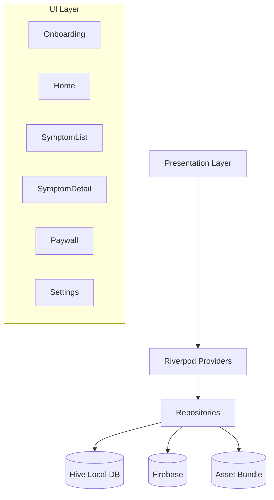
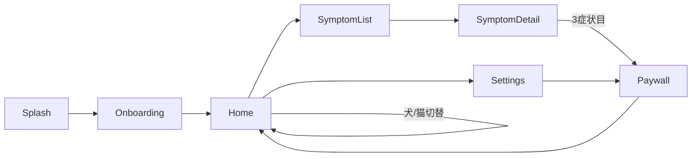

# Pet First 設計書

## アーキテクチャ図



## 画面遷移図



## ディレクトリ構造

```
lib/
├── main.dart
├── app.dart                 # MaterialApp + ルーティング
├── firebase_options.dart
├── l10n/                    # 多言語ARB
├── core/
│   ├── theme/               # テーマ・色（緊急度色含む）
│   ├── router/              # GoRouterルート
│   └── analytics/           # Firebase Analytics wrapper
├── data/
│   ├── models/              # Symptom, FirstAidStep, PetProfile
│   ├── repositories/        # SymptomRepository, PetProfileRepository
│   └── datasources/
│       ├── symptom_local.dart
│       └── symptom_seed.dart  # アセットJSONからのシード
├── features/
│   ├── onboarding/
│   │   ├── presentation/
│   │   └── providers/
│   ├── home/
│   ├── symptom_list/
│   ├── symptom_detail/
│   ├── paywall/
│   ├── pet_profile/         # P1
│   └── hospital_search/     # P1
└── shared/
    ├── widgets/             # 共通ウィジェット
    └── extensions/
```

## カラー設計（緊急度）

| レベル | カラー | Hex | 意味 |
|--------|-------|-----|------|
| Red | Material Red 700 | #D32F2F | 即病院。今すぐ |
| Yellow | Material Amber 700 | #FFA000 | 様子見・受診検討 |
| Green | Material Green 700 | #388E3C | 自宅対処OK |

## ルーティング設計

```dart
final routes = [
  GoRoute(path: '/', builder: (_, __) => SplashScreen()),
  GoRoute(path: '/onboarding', builder: (_, __) => OnboardingScreen()),
  GoRoute(path: '/home', builder: (_, __) => HomeScreen()),
  GoRoute(path: '/symptoms/:petType/:category',
    builder: (_, state) => SymptomListScreen(...)),
  GoRoute(path: '/symptom/:id',
    builder: (_, state) => SymptomDetailScreen(id: ...)),
  GoRoute(path: '/paywall', builder: (_, __) => PaywallScreen()),
  GoRoute(path: '/settings', builder: (_, __) => SettingsScreen()),
];
```

## Provider設計

| Provider | 役割 |
|----------|------|
| `symptomRepositoryProvider` | Symptom DB アクセス |
| `selectedPetTypeProvider` | 犬/猫の選択状態 |
| `symptomViewCountProvider` | 閲覧数カウント（ペイウォール用） |
| `subscriptionStatusProvider` | RevenueCat購読状態 |
| `analyticsServiceProvider` | Firebase Analytics |

## オフライン戦略の実装

1. アプリ初回起動時、`assets/symptoms.json` をHiveにシード
2. 以後は全てHiveから読み取り（Firebase不要）
3. 画像は`assets/symptom_images/` にバンドル

## 実装順序（参考）

1. データモデル + Repository + Hiveシード
2. Home画面 + 犬/猫切替
3. SymptomList + SymptomDetail
4. ペイウォール + RevenueCat連携
5. AdMob統合
6. 多言語ARB
7. オンボーディング
8. Analytics計測

詳細はtasks.mdを参照
