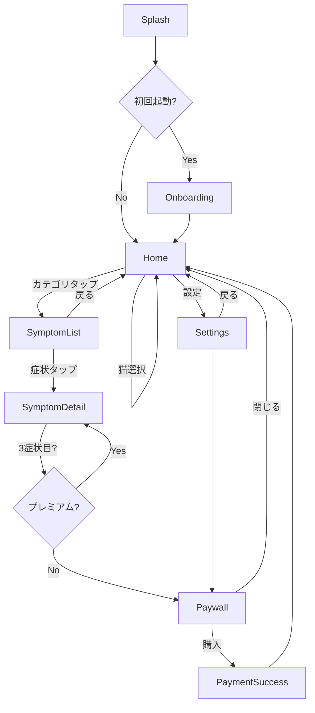

# Pet First ナビゲーションフロー

## メインフロー



## ペイウォール表示ロジック

```
1日の症状閲覧カウント:
  - 1症状目: 自由閲覧
  - 2症状目: 自由閲覧 + バナー強化
  - 3症状目以降: ペイウォール表示

緊急度=赤の症状:
  - カウント外（命に関わるため常時無料）
  - 広告非表示
```

## ディープリンク

| URL | 遷移先 |
|-----|-------|
| `petfirst://home` | Home |
| `petfirst://symptom/{id}` | SymptomDetail |
| `petfirst://paywall` | Paywall |

## エラー時のフロー

| エラー | 動作 |
|--------|-----|
| Hive初期化失敗 | 再試行 → 失敗時はエラー画面 + サポート連絡 |
| RevenueCat接続失敗 | キャッシュされた購読状態を使用、後で再同期 |
| 位置情報拒否（P1） | 病院検索の手動入力モード |
